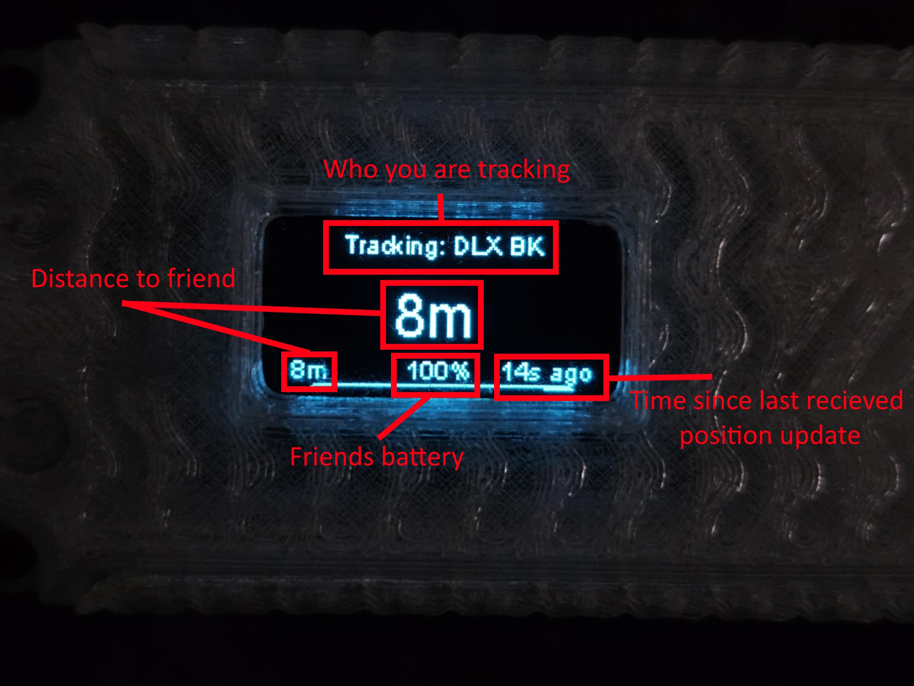

<div align="center">

# Meshtastic Firmware: Friend Finder Edition

**An enhanced version of Meshtastic with real-time, compass-based friend tracking.**

</div>

<div align="center">


</div>

This is a custom build of the official Meshtastic firmware that introduces the **Friend Finder** module. This feature allows you to pair with and track your friends in real-time. The tracking screen shows their distance, and if you have a magnetometer installed, a directional arrow makes it easy to find each other when you get separated.

It was developed and tested in real-world conditions, including a crowded outdoor music concert, where it performed exceptionally well.

---

## 📖 Table of Contents

- [Core Features](#-core-features)
- [UI Showcase](#-ui-showcase)
- [Understanding the Tracking Screen](#-understanding-the-tracking-screen)
- [Hardware Requirements](#️-hardware-requirements)
- [Installation](#-installation)
- [Getting Started: Setup & Usage](#-getting-started-setup--usage)
- [Advanced Features & Tools](#-advanced-features--tools)
- [A Guide to Magnetometer Calibration](#-a-guide-to-magnetometer-calibration)
- [Project Status & Future Goals](#-project-status--future-goals)
- [Performance & Technical Notes](#-performance--technical-notes)
- [License](#-license)

---

## 🎯 Core Features

-   🛰️ **Friend Finder Module**: A new interface to securely pair with other devices and initiate a tracking session.
-   🧭 **Real-Time Tracking Screen**: Shows the live distance to your friend. With a magnetometer, it also displays a large arrow pointing in their direction.
-   📍 **Saved Places**: Save your current GPS location (like your car or campsite) and get a directional arrow to guide you back to it later.
-   🗺️ **Friend Map**: View the locations of all your paired friends simultaneously on a simple map display.
-   ⚙️ **Optional Magnetometer Support**: Includes all necessary drivers and logic to use a QMC5883L magnetometer for directional tracking.
-   🏞️ **Designed for the Outdoors**: Perfect for staying connected at festivals, while skiing, hiking, or at any large-scale event.

---

## ✨ UI Showcase

| Main Menu | Tracking (with Magnetometer) | Tracking (without Magnetometer) | Calibration Menu |
| :---: | :---: | :---: | :---: |
|  |  |  |  |
| *Friend Finder on the main menu.* | *Arrow points to your friend.* | *Only the distance is displayed.* | *Easy access to compass calibration.* |

---

## 📊 Understanding the Tracking Screen

The tracking screen provides live information about your friend's status and location.

### With a Magnetometer

When a calibrated magnetometer is installed, the screen displays a large directional arrow.

<div align="center">

</div>

| Element | Description |
| :--- | :--- |
| **Who you are tracking** | Displays the short name of the friend you are currently in a session with. |
| **Direction to friend** | A large arrow that points in the real-world direction of your friend. |
| **Distance to friend** | The live distance between you and your friend. |
| **Friend's battery** | Your friend's current battery level percentage. |
| **Time since update** | Shows how long ago the last position packet was received from your friend. |

### Without a Magnetometer

If you don't have a magnetometer, the screen will only show the distance to your friend, as there is no directional data.

<div align="center">

</div>

---

## ⚙️ Hardware Requirements

For the Friend Finder module to work, specific hardware is required.

| Component | Model / Specification | Notes |
| :--- | :--- | :--- |
| **Primary Device**| Heltec Wireless Tracker (V3), LilyGo T-LoRa T3-S3 V1 | Other ESP32-S3 devices may work but require individual testing. |
| **GPS Module** | Any Meshtastic-compatible GPS | **Required.** Any module supported by the base firmware will work. The u-blox M8N is recommended for its high accuracy. |
| **Magnetometer** | QMC5883L | **Highly Recommended.** The directional arrow makes finding friends in crowded spaces much easier. Other magnetometers may work but are untested. |

> **IMPORTANT: Magnetometer Wiring**
> The correct I²C pins vary by device. Here are the confirmed wiring configurations. The firmware is designed to use the **secondary I²C bus** (`I2C1`) where available.

#### Heltec Wireless Tracker (V3)
| Magnetometer | Pin | Heltec V3 | Pin |
| :--- | :---: | :--- | ---: |
| **SDA** | -> | **GPIO 41** | |
| **SCL** | -> | **GPIO 42** | |

#### LilyGo T-LoRa T3-S3 V1
| Magnetometer | Pin | T-LoRa S3 | Pin |
| :--- | :---: | :--- | ---: |
| **SDA** | -> | **GPIO 43** | |
| **SCL** | -> | **GPIO 44** | |

#### Finding Pins on Other Devices
To find the correct I²C pins for an unsupported ESP32-S3 board, you must look in the firmware source code for the board's variant file.
1.  Navigate to the variants directory in the source code. The path will be similar to `firmware/src/variants/esp32s3/your_board_name/`.
2.  Open the `variant.h` file.
3.  Search for the following definitions to find the correct GPIO pin numbers for the secondary I²C bus:
    ```cpp
    #define I2C_SDA1 SDA
    #define I2C_SCL1 SCL
    ```

---

## 💾 Installation

The easiest way to install this firmware is by using the custom web flasher.

### **➡️ [Install via Web Flasher](https://leapyeet.github.io/Meshtastic-Firmware-Friend-Finder-Edition/)**

1.  Click the link above to open the web flasher.
2.  Plug your device into your computer via USB.
3.  Click the **Connect & Install** button.
4.  A pop-up window will appear. Select the correct COM port for your device and click "Connect".
5.  The installation will begin automatically. Do not unplug the device until it is complete.

---

## 🚀 Getting Started: Setup & Usage

1.  **Ensure GPS is Active**
    * Before starting, make sure your GPS module is connected and has acquired a solid satellite lock.

2.  **Calibrate the Magnetometer (If Installed)**
    * A proper compass calibration is **essential** for the directional arrow to be accurate. Please follow the detailed instructions in the calibration guide below.

3.  **Pair with Friends**
    * From the main menu, go to `Friend Finder` -> `Start Pairing`.
    * Have your friend do the same on their device. The devices will discover each other and allow you to securely pair.

4.  **Track a Friend**
    * Navigate to `Friend Finder` -> `Track a Friend`.
    * Select your friend from the list to begin a mutual tracking session.
    * The device will switch to the tracking screen.

---
## 🛠️ Advanced Features & Tools

### 📍 Using Saved Places
This feature lets you save your current location to one of four available slots. You can then start a tracking session to get a directional arrow that guides you back to that spot—perfect for finding your car, tent, or campsite.

**To Save a Location:**
1.  Stand at the physical location you wish to save. A GPS lock is required.
2.  Navigate to `Friend Finder` -> `Saved Places`.
3.  Select **"Save Current Location"**.
4.  The device will save your coordinates to the first available empty slot (e.g., "Place 1").

**To Track a Saved Location:**
1.  Navigate to `Friend Finder` -> `Saved Places`.
2.  Select the place you want to track from the list (e.g., "Place 1").
3.  From the action menu, choose **"Track"**.
4.  The tracking screen will appear and guide you to your saved location.

### 🔬 Developer Tools
This menu contains diagnostic tools for testing and debugging. More tools may be added in the future.

**Spoof Test**
The Spoof Test is a tool to verify that your compass and the arrow-drawing logic are working perfectly, independent of any real-world GPS or LoRa issues.

When you start a test, it creates a fake target exactly 1km away in a perfect cardinal direction (North, East, South, or West) from your current location.

**How to Run the Test:**
1.  Navigate to `Friend Finder` -> `Dev Tools` -> `Run Spoof Test`.
2.  Select a target to track, for example, **"Track East"**.
3.  Physically point the top of your device towards **True North** (your compass screen should read 0°).
4.  The arrow on the tracking screen should now point directly to the **right** (90°). If it does, your UI is behaving as expected.

---
## 🧭 A Guide to Magnetometer Calibration

### Why is Calibration Important?
Your magnetometer (compass) is sensitive to magnetic fields. This includes not only the Earth's magnetic field but also interference from nearby electronics, batteries, and metal objects. Calibration is crucial to teach the sensor how to distinguish between the Earth's magnetic north and this local interference, ensuring the directional arrow is accurate.

### When to Calibrate
You should perform a full two-step calibration:
-   **Upon first installation** of the magnetometer.
-   If you add or move components inside your device's case.
-   If the directional arrow seems consistently inaccurate or erratic.

### The Two-Step Calibration Process
For the best results, perform these calibrations outdoors, away from large metal objects like cars, buildings, or metal benches.

#### **1. Figure-8 Calibration (Hard & Soft Iron)**
This is the most important step. It corrects for magnetic fields originating from the device itself (like the battery, speaker, or wires).

1.  On the device, navigate to `Friend Finder` -> `Compass Cal`.
2.  Select **Figure-8 Cal** from the menu.
3.  Hold the device out in front of you.
4.  For 15 seconds, slowly move the device in a large figure-8 pattern. As you move it, twist and rotate your wrist to ensure the device points in every possible direction (up, down, left, right, forwards, backward, etc.). Imagine you are a flying a toy airplane through loops and rolls.
5.  The screen will return to the compass view when complete.

#### **2. Flat-Spin Calibration (2D Alignment)**
This routine fine-tunes the compass for when it's held relatively flat, which is a common use case.

1.  On the device, navigate to `Friend Finder` -> `Compass Cal`.
2.  Select **Flat-Spin Cal** from the menu.
3.  Place the device face-up on a flat, **non-metallic** surface (a wooden table or the ground works well).
4.  For 12 seconds, smoothly rotate the device **CLOCKWISE**. Try for at least 2-3 full rotations.
5.  The screen will return to the compass view when complete.

### Additional Compass Tools
The calibration menu has a few other useful tools:
-   **Set North Here**: If you have a real compass and know which way is true north, point the top of the device in that direction and select this option. It will apply an offset so the device's 0° heading aligns with true north.
-   **Clear North Offset**: Removes any manual offset created by "Set North Here".
-   **Flip North**: This flips the compass heading by 180°. Use this if your magnetometer was accidentally installed backward and the arrow points directly away from your friend.

### Troubleshooting Tips
-   **Arrow points the wrong way:** If the arrow consistently points in the wrong direction (e.g., behind you), first try the **Flip North** option. If it's still off, you likely spun the device **counter-clockwise** during the Flat-Spin calibration. Redo the flat-spin, ensuring you rotate smoothly clockwise.
-   **Arrow is erratic or "jumpy":** This usually indicates strong local magnetic interference. Make sure the magnetometer is mounted away from wires (especially the battery lead) and other metal components. You should also redo the **Figure-8 calibration** away from any potential sources of interference.

---

## 🚧 Project Status & Future Goals

Please be aware that this entire project is a **work in progress**.

-   **Source Code**: The source code is available [**HERE**](https://github.com/LeapYeet/firmware). The module files are at `src/modules/FriendFinderModule.cpp`.
-   **End Goal**: The ultimate goal is to refine this module and merge it with the official Meshtastic firmware repository so everyone can benefit from it.
-   **Testing Needed**: Before an official merge is possible, extensive testing is required. Community feedback and testing are highly encouraged!
-   **Community Support**: Special thanks to contributor **Nullvoid3771** for testing and confirming support for the LilyGo T-LoRa T3-S3 V1. The project owner is willing to investigate pin definitions and create new web flasher builds for other devices upon request. Please open an issue on GitHub to start the process.

---

## 📡 Performance & Technical Notes

-   **LoRa Settings**: All testing has been conducted using the **LongFast** channel preset.
-   **Update Interval**: To keep channel utilization low, position updates are sent every **20 seconds**. Faster LoRa settings may support more frequent updates, but this requires further community testing.
-   **Range**: The effective tracking range depends entirely on your device, antenna, LoRa settings, and the surrounding environment. Hops may not be supported, this hasn't been tested.

---

## 📝 Notes:

1. 
    * If the tracking compass is rotating the wrong way: You need to redo the flat-spin calibration **CLOCKWISE ->**
    * When installing the magnetometer chip to the device, keep it away from other components and wires for better accuracy. Make sure it's firmly secured and flat.
    * As said above, use ports SDA=41, SCL=42. If it doesn't work, try flipping the wires.
    * A decent GPS module is recommended. All testing was done with u-blox m8n chips. My testing showed they were accurate to 1-3m when used outdoors.
    * The Meshtastic Android app is fully usable with this custom firmware.
    * If you want to stop a friend tracking you permanently, you will have to remove them as a friend on the "Track a friend" menu.
    * I recommend a 3000mah battery when paried with a heltec v3 if you want it to last a full day.

---

## Final words:
This project as been my main focus since Feburary 2025. I've had lots of fun developing it and I feel like it will be a great addition to the offical firmware when it's fully polished. It's really exciting to see how everyone will be using it. 

I tested it at a large 1 day music festival in Milton Keynes in august and it worked great. Security didn't know what to think when getting in but saw no issue after showing them how it worked. I was able to walk into the crowd and later find my friends with no issues at all. I simply started a tracking session and the arrow pointed me to the group from 350 meters away.

I love you all, have fun!


## 📜 License

This project is a derivative work of the official Meshtastic firmware and is therefore licensed under the **GNU General Public License v3.0 (GPL-2.0)**. The original `LICENSE` file is included in the source code.